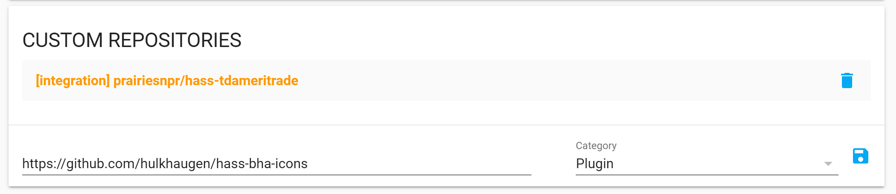
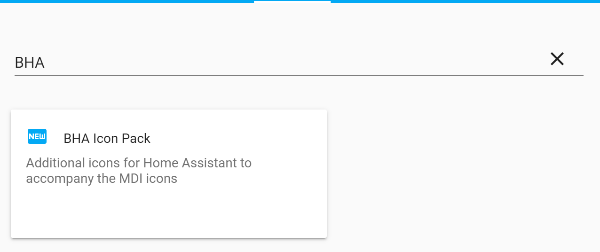
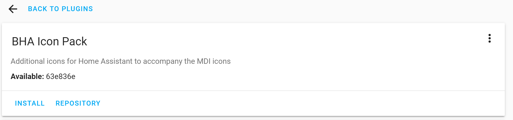
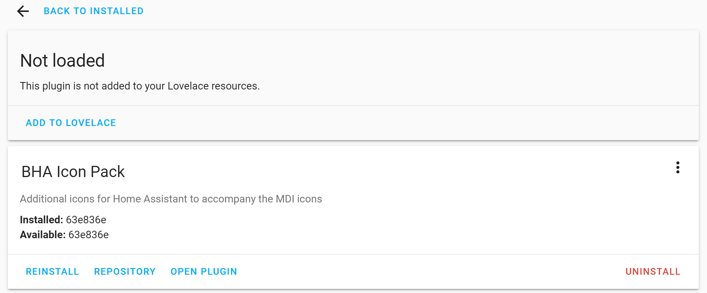

# HACS Install - Step by Step

### Add this repo to HACS as a plugin.
 

### Find the plugin and install
 
 

### Add the plugin to lovelace
 

The icons will be available under the bha namespace, eg bha:floor-lamp

There is no need to restart.
